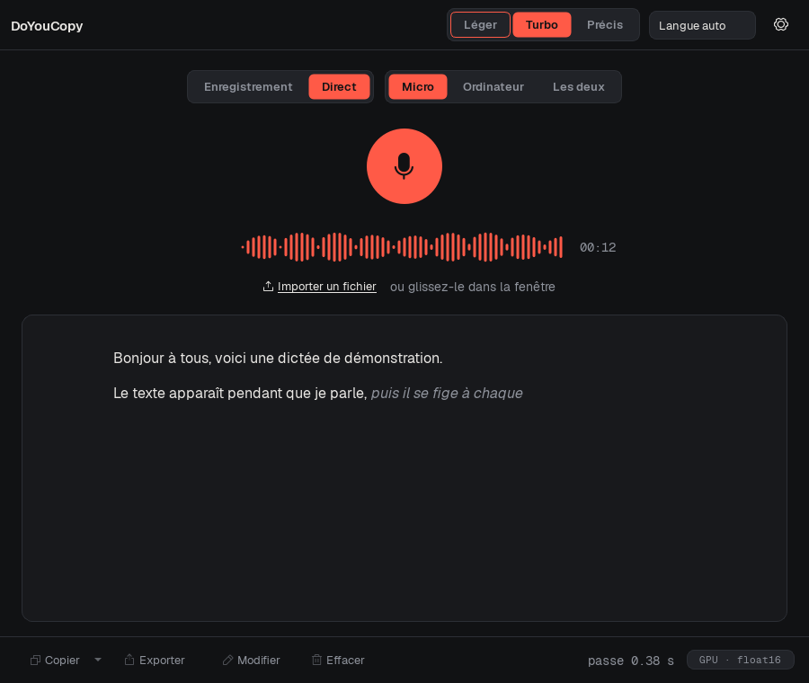
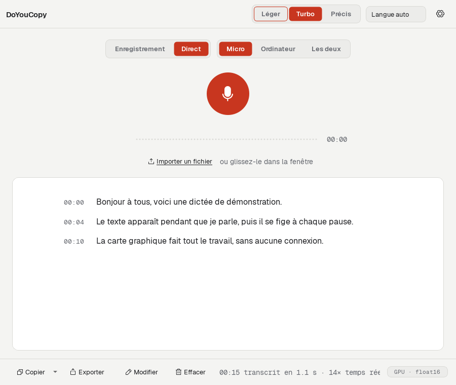

<div align="center">

# MyWhisper

**Private, offline speech-to-text for Windows.**
Dictate into any app or transcribe audio files. Everything runs on your own PC, and nothing leaves it.


[](LICENSE)

| Live mode, dark theme | Finished transcript, light theme |
|---|---|
|  |  |

</div>

## Your voice stays on your PC

Most dictation tools send your voice to someone else's computer. **Windows voice typing (Win + H)** uses Microsoft's online speech recognition. Google Docs voice typing, and cloud transcription services, work the same way. Your audio, and the text made from it, go to their servers. There they can be stored, analyzed or used to train models, under terms you don't control.

MyWhisper works differently:

- 🔒 **Transcription runs 100% on your machine.** Audio and text never leave it.
- 🚫 **No account, no telemetry, no analytics, no cloud.**
- ✈️ **Works offline.** The internet is only needed once, to download the speech model (from Hugging Face) and the GPU acceleration (from AMD, NVIDIA and PyPI). After that you can unplug the network, or turn on *strict offline mode* in the settings.
- 📂 **Open source.** You can check every line of code that touches your audio.

Good for meetings, interviews, medical or legal notes, or anything you'd rather not upload.

## Features

- **Dictate anywhere.** Hold **Ctrl + Shift + Space** in any app, speak, release: the text is typed where your cursor is.
- **Live mode.** Text appears while you speak.
- **Meetings and videos.** Capture what your computer plays (Teams, Zoom, YouTube…), alone or mixed with your microphone.
- **Files.** Drag in audio or video (wav, mp3, m4a, flac, ogg, mp4…) and watch the transcript appear segment by segment.
- **Whisper models.** *Light* (small), *Turbo* (large-v3-turbo, default) or *Precise* (large-v3). Automatic language detection, and translation to English.
- **Custom vocabulary.** Words to favor, replacements, and voice commands for punctuation ("comma", "new line"…).
- **History.** Every transcript is saved on your PC as you go, with instant full-text search.
- **Synchronized editor.** Play the audio back, follow the highlighted word, click a word to jump there, fix the text without losing the timestamps. Doubtful words are underlined, and a passage can be transcribed again with the Precise model.
- **Export** to TXT, SRT, WebVTT, Markdown, Word (.docx) and JSON.

## Hardware: GPU or CPU

MyWhisper is built on [faster-whisper](https://github.com/SYSTRAN/faster-whisper). The installer detects your graphics card and downloads the right acceleration:

| Hardware | Acceleration | Speed |
|---|---|---|
| **NVIDIA** GeForce GTX 900 or newer, RTX | CUDA 12 | ⚡ Fast |
| **AMD** Radeon RX 6800 / 6900, RX 7000, RX 9000, Radeon 780M / 880M / 890M | ROCm 7.2 | ⚡ Fast |
| **No compatible GPU** (Intel, older AMD, none) | CPU (int8) | 🐢 Works, but much slower |

For example, on a Radeon RX 7800 XT, 15 s of speech is transcribed in about 1 second (14× real time).

> [!NOTE]
> **CPU only?** MyWhisper still works, but transcription takes a lot longer, especially with long files and the Precise model. Choose the **Light** model for the best speed. If the GPU can't be used (for example, the driver is too old), MyWhisper switches to the CPU on its own and tells you why.

## Installation

1. Download `MyWhisper-Setup-<version>.exe` from the [Releases](https://github.com/matmout/Mywhisper/releases) page (Windows 10 / 11, 64-bit).
2. Run it. **No administrator rights are needed**: it installs into your user profile.
3. At the end of setup, MyWhisper detects your graphics card and downloads the matching acceleration (~1.2 GB, from official sources, with pinned versions and SHA-256 checks). It then tests the card for real.
4. On first launch, the Turbo model (~1.6 GB) downloads with a progress bar. After that, no internet connection is needed.

> [!TIP]
> The installer isn't code-signed yet, so Windows SmartScreen may say *"Windows protected your PC"*. Click **More info**, then **Run anyway**.

To uninstall, go to **Settings → Apps**. You can choose to keep or remove the downloaded models and settings.

<details>
<summary><b>Install from source (developers)</b></summary>

Requirements: Python 3.10–3.14 (x64) and a recent GPU driver. The script below sets up the AMD ROCm build:

```powershell
powershell -ExecutionPolicy Bypass -File scripts\install_rocm.ps1
.\.venv\Scripts\mywhisper.exe
```

It creates `.venv`, installs the ROCm runtime and the ROCm build of CTranslate2, installs MyWhisper, checks the GPU and downloads the models. To build the installer, use `scripts\build_installer.ps1` (needs [Inno Setup 6](https://jrsoftware.org/isinfo.php)).

To run the tests:

```powershell
.\.venv\Scripts\python.exe -m pytest
```

</details>

## Keyboard shortcuts

| Shortcut | Action |
|---|---|
| Ctrl + Shift + Space | Dictate into any app (you can change it) |
| Ctrl + R | Start / stop recording |
| Ctrl + L | Start / stop live mode |
| Ctrl + O | Open an audio or video file |
| Ctrl + S | Export the transcript |
| Ctrl + H | Show / hide the history |
| Ctrl + E | Edit the transcript |
| Ctrl + Space | Play / pause the audio |
| Ctrl + ← | Go back 5 seconds |

## Documentation

The full guide (in French) covers every setting, the export formats, how live mode works, troubleshooting and the architecture: [docs/GUIDE.fr.md](docs/GUIDE.fr.md).

> The interface is currently in French.

## License

MyWhisper is free software, released under the [GNU General Public License v3.0](LICENSE) or later. You can use, study, modify and share it. If you distribute a modified version, it must stay open source under the same license, so anyone can check what it does with their voice.

## Acknowledgements

[OpenAI Whisper](https://github.com/openai/whisper) · [faster-whisper](https://github.com/SYSTRAN/faster-whisper) · [CTranslate2](https://github.com/OpenNMT/CTranslate2) · [whisper_streaming](https://github.com/ufal/whisper_streaming) · [PySide6](https://doc.qt.io/qtforpython-6/) · [Geist](https://github.com/vercel/geist-font)
